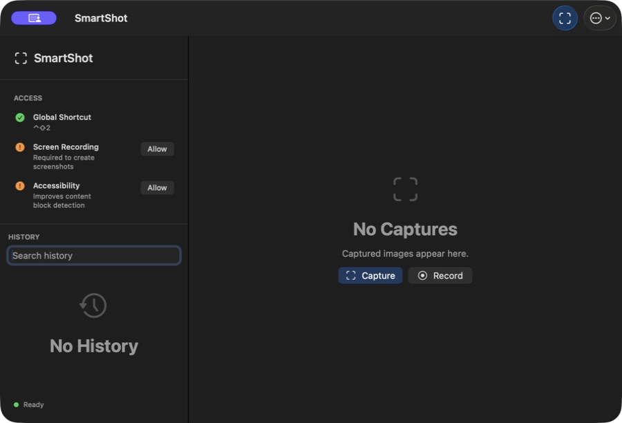

# SmartShot

**Capture, annotate, and record on macOS.**

SmartShot combines smart block selection, region and long screenshots, an image editor, on-device OCR, and screen recording in a native macOS app. Capture processing stays on your Mac: no account, analytics, or cloud upload service.

[English](README.md) | [简体中文](README.zh-CN.md)

macOS 14+ · Swift 6 · Preview releases



## Features

| Workflow | What you can do |
| --- | --- |
| Screenshot | Select a window or accessible content block, cycle nested candidates, or drag a region. Use a configurable global shortcut and optional capture delay. |
| Long capture | Stitch a fixed region while scrolling manually; use **Automatic App Scroll (Experimental)** for compatible native scroll areas; capture a whole webpage content block with the browser extension. |
| Edit | Crop, draw, add arrows, rectangles, ellipses, text, and numbered markers. Apply mosaic, blur, opaque redaction, spotlight, or magnifier effects. Move/delete annotations, undo/redo, and zoom from 100% to 400%. |
| OCR and redaction | Recognize text locally with Apple Vision, copy it, or cover recognized text. Sensitive-text assistance detects supported email, phone, payment-card, and Chinese-ID patterns. Review its results before sharing. |
| Save and pin | Copy the rendered screenshot, pin it above other windows, save PNG/JPEG, or Quick Save to a chosen folder. **Flatten** replaces the current image and its history copy with the rendered edits. |
| History and privacy | Browse, search, reopen, and manage local history. OCR search is opt-in. Private screenshots skip automatic history and clipboard copies while keeping explicit output actions available. |
| Record | Record a region or the current display to MP4, with optional system audio, microphone, and pointer. Choose 15/30/60 fps and a 1920/2560/3840-pixel maximum edge. Preview, Save As, or export a GIF. |
| Automate | Trigger capture, Quick Save, or Show through a URL scheme or the bundled command-line launcher. |

## Download

[Download the newest SmartShot Preview](https://github.com/infinityf4p/SmartShot/releases). Each release supports Apple Silicon and Intel Macs in one universal application. Choose its assets below:

- macOS DMG: `SmartShot-<version>-universal.dmg`
- macOS ZIP: `SmartShot-<version>-universal.zip`
- Browser extension ZIP: `SmartShot-Web-Selector-<version>.zip`
- SHA-256 checksums: `SHA256SUMS.txt`

This preview is ad-hoc signed, without a Developer ID certificate or Apple notarization. macOS may block a downloaded copy until you explicitly approve it in Finder or Privacy & Security. The packaged app has no `get-task-allow` debugging entitlement.

## Get Started

1. Move `SmartShot.app` to `/Applications`, launch it, and allow **Screen Recording**. **Accessibility** enables smart block selection; microphone access is optional.
2. Click **Capture** or press `Control-Shift-2` (configurable in Settings), then choose a capture mode. Press Escape to cancel.
3. Edit, Copy, Pin, or Save. **Save** writes to your chosen folder; its arrow opens the save dialog. Close the screenshot to return home. Record through **More > Record Region / Record Current Display**.

English is the default. Choose **Settings > General > Language > 简体中文** and restart to switch to Chinese; the selection is saved.

## Build Locally

Requires macOS 14+, Xcode with Swift 6, and [XcodeGen](https://github.com/yonaskolb/XcodeGen).

```sh
git clone https://github.com/infinityf4p/SmartShot.git
cd SmartShot
xcodegen generate
xcodebuild -project SmartShot.xcodeproj -scheme SmartShot \
  -configuration Release -derivedDataPath DerivedData \
  build CODE_SIGN_IDENTITY=- DEVELOPMENT_TEAM= \
  CODE_SIGN_INJECT_BASE_ENTITLEMENTS=NO
open DerivedData/Build/Products/Release/SmartShot.app
```

This uses ad-hoc signing without a signing certificate; macOS may require new permissions. For Safari extension development, see [Safari development builds](Docs/SAFARI_DEVELOPMENT_BUILD.md).

## Browser Extension

The extension selects one webpage content block and produces a PNG. It captures visible content directly or scrolls and stitches a bounded tall block, restores page state, then imports the image into SmartShot. If native import fails, it falls back to a browser download.

**Chrome / Chromium / Edge / Brave**

1. Install the complete normal app bundle at `/Applications/SmartShot.app`, then use **Settings > Chromium Integration > Install** to configure its native host.
2. Open the browser's Extensions page, enable Developer mode, and **Load unpacked** from the extracted browser extension ZIP or this checkout's `BrowserExtension` directory. Reload it after updating. The app's **Reveal Extension** button locates the copy packaged with an installed build.
3. Open a permitted webpage and invoke **SmartShot Web Selector** from the toolbar or `Control-Shift-9` on macOS. Select a block and confirm with a click or Return.

**Safari**

Safari requires a compatible Apple development signature or the dedicated **Sign to Run Locally** build. The latter requires **Settings > Developer > Allow unsigned extensions**, extension enablement, and Website Access; Safari resets the unsigned override when it quits. A normal ad-hoc or custom self-signed build is not sufficient on its own. Safari capture/import is still awaiting full runtime acceptance.

See the [extension guide](BrowserExtension/README.md) for installation, permissions, capture bounds, and native messaging details.

## Scope and Privacy

- Long capture has three distinct paths: manual fixed-region scrolling, experimental native AX scrolling, and browser DOM-block capture. Native automatic scrolling requires static content and a writable vertical accessibility scrollbar. Dynamic/infinite feeds, virtualized or nested scrolling, horizontal capture, and cross-display stitching are outside the current support scope.
- Browser selection includes fixtures for a single X post. It does not automatically capture a thread or multiple posts, and compatibility with the current public X site is unverified.
- Recording uses one display. GIF export is silent and capped at the first 30 seconds, 15 fps, a 1280-pixel long edge, and 450 frames. Camera capture, video trimming, click visualization, translation, and cloud sharing/sync are not implemented.
- Screenshot history is local. OCR indexing is off by default and never applies to Private captures. Private screenshot mode does not govern recordings or browser fallback downloads.
- Blur and mosaic are visual effects. Use opaque redaction for sensitive content and inspect the exported image; OCR-based detection is not guaranteed to find every sensitive value.
- Browser native import carries the PNG and limited technical metadata, including the site origin. It does not transmit page HTML, cookies, credentials, or URL paths. Safari's current named-pasteboard transport has documented same-user authentication and crash-cleanup limitations in the [handoff](Docs/HANDOFF.md).

## Project Guide

- [Architecture](Docs/ARCHITECTURE.md)
- [Requirements and scope](Docs/MVP_REQUIREMENTS.md)
- [Roadmap](Docs/ROADMAP.md)
- [Test plan and evidence](Docs/TEST_PLAN.md)
- [Browser extension](BrowserExtension/README.md)
- [Safari development builds](Docs/SAFARI_DEVELOPMENT_BUILD.md)
- [Automatic preview releases](Docs/PREVIEW_RELEASES.md)

Maintained by [infinityf4p](https://github.com/infinityf4p).
